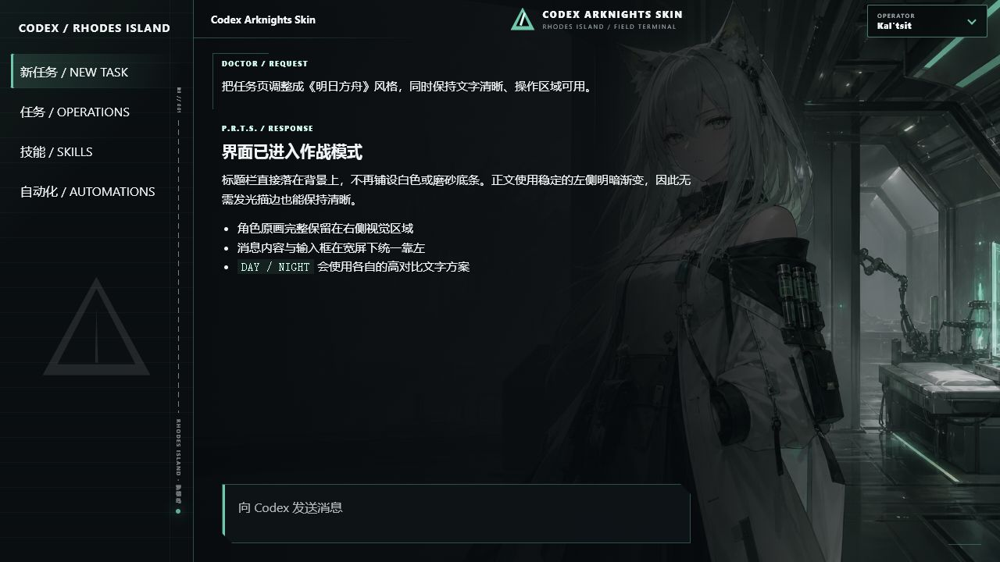
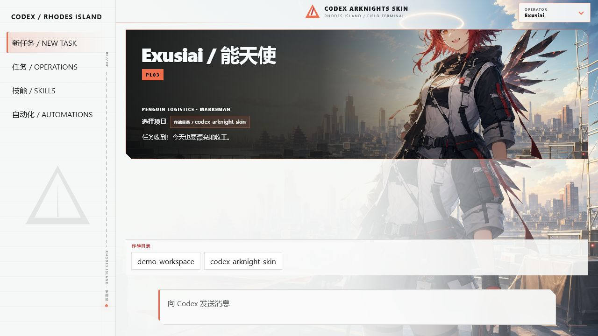
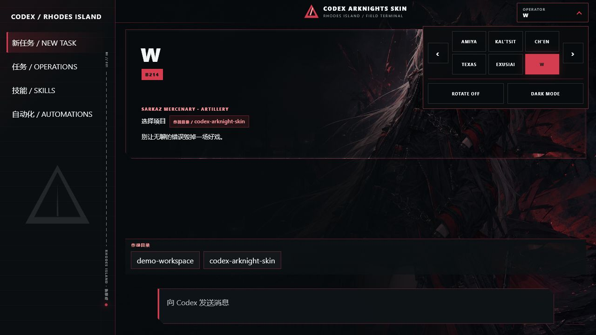

# Codex Arknights Skin

<p align="center">
  <strong>中文</strong> · <a href="./README.en.md">English</a>
</p>

<p align="center">
  给 Codex 桌面端装上一套会随干员、时间与任务状态变化的《明日方舟》主题。<br>
  六位干员 · 手动选择 · 自动轮播 · 白天/夜间自适应 · Windows / macOS
</p>

> 《明日方舟》的官方英文名是 **Arknights**，因此项目标题使用 **Codex Arknights Skin**。

## 基于 Codex Dream Skin 开发

本项目基于 [Fei-Away/Codex-Dream-Skin](https://github.com/Fei-Away/Codex-Dream-Skin) 开发，沿用了其可恢复的本机 CDP 注入、安全启动、验证与恢复机制，并在此基础上重新设计了 Arknights 多角色视觉系统、角色切换、自动轮播和白天/夜间显示。

感谢原作者与贡献者。上游项目采用 MIT 许可；本仓库保留了相应许可与来源声明。Arknights 主题内容是本仓库的非官方二次创作，与上游作者无关。

## 界面预览

以下截图由仓库内的预览页直接加载正式主题 CSS 与角色资源后渲染，内容全部是演示数据，不包含任何真实任务、账号、目录或对话信息。

<p align="center">
  
</p>
<p align="center">
  
  
</p>

## 干员主题

| 干员 | 定位 | 主色 |
|---|---|---|
| Amiya / 阿米娅 | Rhodes Island Leader · Caster | 冷灰 / 青蓝 |
| Kal'tsit / 凯尔希 | Rhodes Island Medic · Command | 骨白 / 医疗绿 |
| Ch'en / 陈 | Lungmen Guard · Swordmaster | 深蓝 / 信号红 |
| Texas / 德克萨斯 | Penguin Logistics · Vanguard | 石墨 / 暮紫 |
| Exusiai / 能天使 | Penguin Logistics · Marksman | 日光 / 珊瑚红 |
| W | Sarkaz Mercenary · Artillery | 碳黑 / 深红 |

## 交互方式

右上角的 `OPERATOR` 按钮用于展开紧凑控制器；默认折叠，不占用消息区或输入框：

- 点击干员名称：立即切换背景、强调色、代号、职业与文案，并自动暂停轮播。
- `ROTATE ON / OFF`：开启或关闭每 12 秒一次的自动轮播。
- `AUTO / DAY / NIGHT MODE`：自动模式按本地时间在 07:00–18:00 使用白天显示，其余时间使用夜间显示；也可手动强制白天或夜间。
- 左侧栏包含低对比罗德岛三角徽记、`RI // 001` 舰船刻度与状态灯；装饰会跟随当前干员强调色变化，不拦截任何操作。
- 选择与显示偏好保存在本机，重新启动主题后继续生效。
- 系统开启“减少动态效果”时，扫描线和进入动画会自动关闭。

白天模式使用冷白纸面和深色文字，夜间模式使用黑蓝战术终端和浅色文字。任务标题栏不再铺底，正文也不使用发光描边或消息卡片；清晰度由整幅背景的左侧渐变保证，角色原画仍会在右侧完整透出。宽屏任务页会把消息与输入框一起靠左，为角色主体留出空间；1120px 以下自动恢复原生居中全宽。

## 安装

### Windows

要求 Node.js 22 或更高版本，并使用 Microsoft Store 安装的官方 Codex 桌面端。

```powershell
cd windows
powershell -ExecutionPolicy Bypass -File scripts\install-dream-skin.ps1
powershell -ExecutionPolicy Bypass -File scripts\start-dream-skin.ps1
```

验证主题：

```powershell
powershell -ExecutionPolicy Bypass -File scripts\verify-dream-skin.ps1
```

恢复官方外观：

```powershell
powershell -ExecutionPolicy Bypass -File scripts\restore-dream-skin.ps1 -Uninstall
```

### macOS

进入 [`macos/`](./macos/) 目录，依次双击：

1. `Install Codex Dream Skin.command`
2. `Start Codex Dream Skin.command`
3. 需要恢复时运行 `Restore Codex Dream Skin.command`

macOS 版本会验证并复用 Codex 自带的已签名 Node.js 运行时，不修改官方应用包、`app.asar` 或代码签名。

## 安全边界

- 主题通过仅绑定 `127.0.0.1` 的 Chromium DevTools Protocol 注入。
- 不修改 Codex 官方安装目录、二进制、签名、API Key 或 Base URL。
- 不替换整窗截图；侧栏、任务、建议按钮、项目选择器与输入框仍是原生交互控件。
- CDP 没有同一系统用户内的额外认证。主题运行时不要执行不可信的本机程序；不用时请运行 Restore。
- 启动脚本在检测到已运行的 Codex 时会要求确认，不会静默强制重启。

## 开发与测试

```powershell
# Windows
powershell -NoProfile -File windows\tests\run-tests.ps1

# 载荷与 JavaScript 语法
node windows\scripts\injector.mjs --check-payload
node macos\scripts\injector.mjs --check-payload
```

macOS 的完整测试需在 macOS 上运行：

```bash
cd macos && npm test
```

## 素材、商标与免责声明

本项目是非官方、非商业的同人主题，与 Hypergryph、Yostar、OpenAI 或上游项目作者不存在隶属、赞助或背书关系。

- Arknights、《明日方舟》、角色名称、角色设定及相关商标归其各自权利人所有。
- 仓库中的六张角色背景是为本项目生成的同人主题图，不是游戏官方原画；外观设计参考了角色公开设定，未复制特定原画构图。
- 生成方式与素材用途记录在 [`docs/ASSET_PROVENANCE.md`](./docs/ASSET_PROVENANCE.md)。
- 本仓库仅提供个人桌面美化用途。若要商用、再分发或制作收费主题，请自行取得必要授权。

软件代码按 [`LICENSE`](./LICENSE) 中的 MIT 许可提供；该许可不授予任何第三方角色、商标、作品或应用程序的权利。
